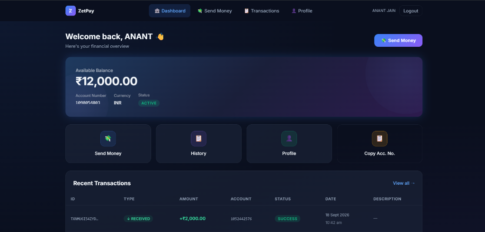
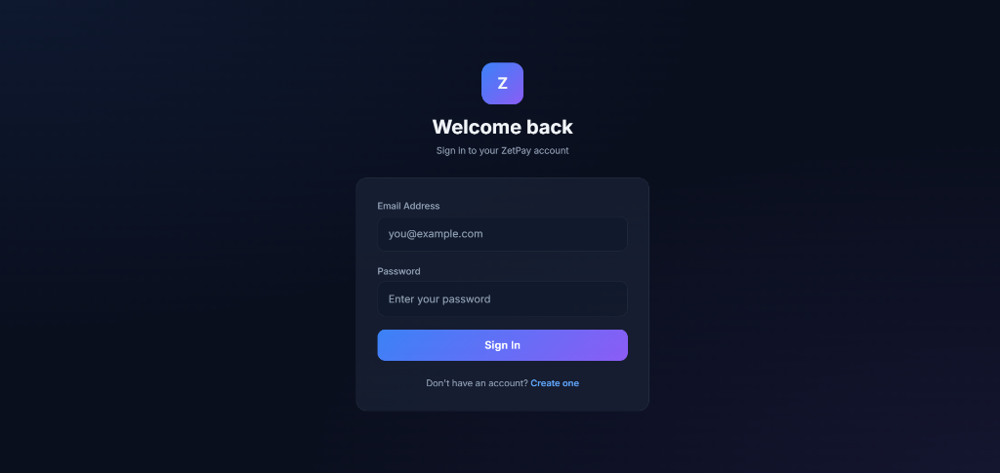
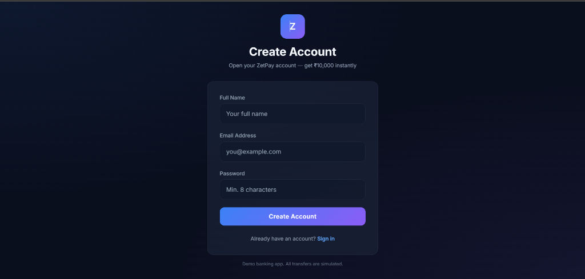
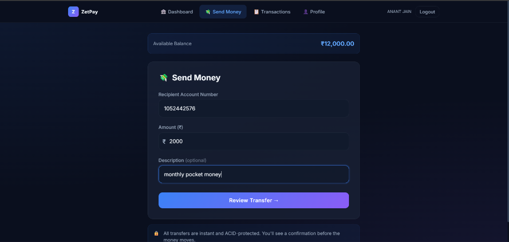
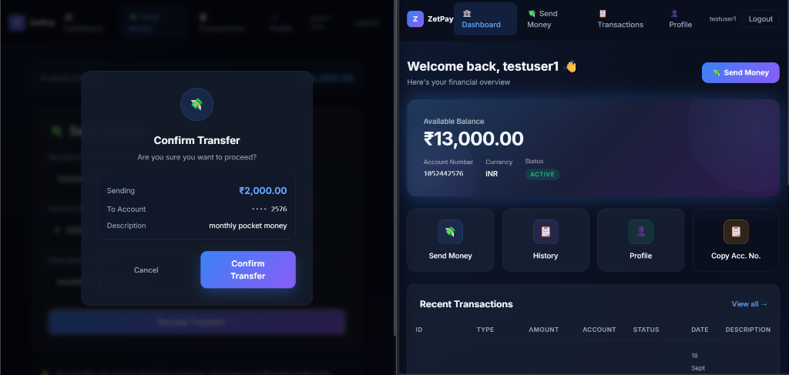
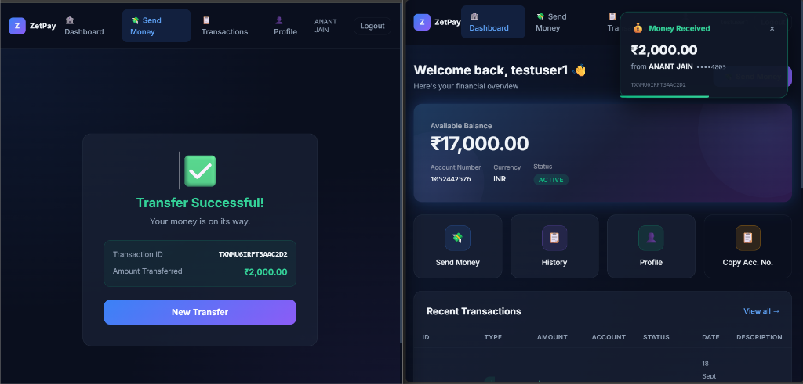
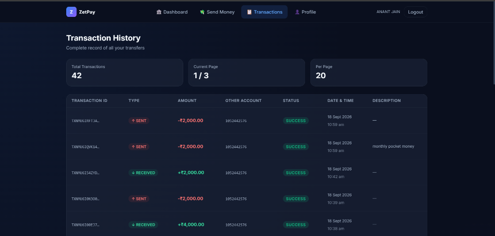

# Banking Money Transfer System

> A secure, transactional, full-stack banking money-transfer simulation built as a production-grade demonstration of financial engineering.

---

## Overview

ZetPay is a full-stack banking application that simulates money transfers between accounts. It demonstrates production-quality engineering: **ACID database transactions**, **concurrency-safe transfers**, **idempotent API design**, **JWT authentication**, **comprehensive input validation**, and **real-time Socket.IO notifications**.



---

> [!NOTE]
> **Render Free Tier — Cold Start**
> The backend is hosted on Render's free tier, which **spins down after 15 minutes of inactivity**.
> The first request after inactivity takes **30–60 seconds** while the server restarts.
>
> The app handles this automatically:
> - 🔄 **Keep-alive ping** — frontend pings `/health` every 10 minutes to prevent spin-down during active use
> - 🖥️ **Waking screen** — if the server is sleeping, a friendly overlay appears and auto-retries every 8 seconds until it's back online

---

## Features

| Feature | Status |
|---|---|
| User registration & login | ✅ |
| Bank account creation (auto on register) | ✅ |
| Account balance in paise (integer, no floats) | ✅ |
| Money transfer between accounts | ✅ |
| Insufficient balance protection | ✅ |
| ACID transactions (MongoDB sessions) | ✅ |
| Concurrency-safe transfers (atomic `$inc`) | ✅ |
| Idempotency key support | ✅ |
| Full transaction history | ✅ |
| Paginated transaction list | ✅ |
| Transfer confirmation modal | ✅ |
| **Real-time notifications (Socket.IO)** | ✅ |
| **Live balance update without refresh** | ✅ |
| **Duplicate event protection (deduplication)** | ✅ |
| Loading / empty / error UI states | ✅ |
| JWT in HTTP-only cookies | ✅ |
| Bcrypt password hashing | ✅ |
| Helmet security headers | ✅ |
| CORS (origin-restricted) | ✅ |
| Rate limiting (auth + transfer) | ✅ |
| Input validation (Zod) | ✅ |
| Centralized error handling | ✅ |
| Database indexes | ✅ |
| Immutable transaction ledger | ✅ |
| Unit tests | ✅ |
| Integration tests | ✅ |

---

## Tech Stack

### Frontend
- **React** + **Vite** — Fast development and optimized builds
- **Tailwind CSS** — Utility-first styling with dark glassmorphism theme
- **React Router v6** — Client-side routing with protected routes
- **Axios** — HTTP client with interceptors and credential support
- **Socket.IO Client** — Real-time WebSocket communication

### Backend
- **Node.js** + **Express.js** — REST API server
- **Socket.IO** — WebSocket server for real-time event broadcasting
- **MongoDB** + **Mongoose** — Document database with replica set for transactions
- **Zod** — Runtime schema validation
- **bcryptjs** — Password hashing (cost factor 12)
- **jsonwebtoken** — JWT generation and verification
- **Helmet** — HTTP security headers
- **express-rate-limit** — Rate limiting middleware

### Testing
- **Jest** — Test runner
- **Supertest** — HTTP integration testing
- **mongodb-memory-server** — In-memory MongoDB with replica set

---

## Architecture

```
React UI (Vite)
     │
     ├── HTTP (Axios, withCredentials) ──► REST API (Express)
     │                                          │
     │                                          ├── Helmet / CORS / Rate Limit / Zod
     │                                          ├── JWT Auth (HTTP-only cookies)
     │                                          │
     │                                          ▼
     │                               Controllers → Services → MongoDB
     │                                               │
     │                                               └── session.withTransaction() ← ACID
     │                                                            │
     │                                                          COMMIT
     │                                                            │
     └── WebSocket (Socket.IO) ◄───────────────── Emit money_received event
```

### Backend Layers

```
Route → Controller → Service → Database
```

- **Routes**: URL mapping and middleware chain
- **Controllers**: HTTP layer — request/response only
- **Services**: Business logic — all banking rules live here
- **Models**: Mongoose schemas with indexes

---

## Database Schema

### User
```js
{
  name: String,
  email: String (unique index),
  passwordHash: String (bcrypt, never returned),
  createdAt, updatedAt
}
```

### Account
```js
{
  accountNumber: String (unique index, 10-digit),
  userId: ObjectId (ref: User),
  balancePaise: Number (integer, stores paise not rupees),
  currency: 'INR',
  status: 'ACTIVE' | 'FROZEN' | 'CLOSED',
  createdAt, updatedAt
}
```

### Transaction (Ledger)
```js
{
  transactionId: String (unique, e.g., TXN1K8Z3F2B),
  senderAccountId: ObjectId (index),
  receiverAccountId: ObjectId (index),
  amountPaise: Number (integer),
  currency: 'INR',
  status: 'SUCCESS' | 'FAILED',
  description: String,
  idempotencyKey: String (unique sparse index),
  createdAt (index)
}
```

---

## API Documentation

### Base URL
```
http://localhost:5000/api/v1
```

### Authentication

| Method | Endpoint | Description | Auth |
|---|---|---|---|
| POST | `/auth/register` | Register user + create account | No |
| POST | `/auth/login` | Login, get JWT cookie | No |
| POST | `/auth/logout` | Clear JWT cookie | No |
| GET | `/auth/me` | Get current user | Yes |
| GET | `/auth/socket-token` | Get short-lived Socket.IO auth token | Yes |

### Accounts

| Method | Endpoint | Description | Auth |
|---|---|---|---|
| GET | `/accounts/me` | Get my account | Yes |
| GET | `/accounts/:accountNumber` | Lookup account | Yes |

### Transfers

| Method | Endpoint | Description | Auth |
|---|---|---|---|
| POST | `/transfers` | Execute money transfer | Yes |

Transfer request body:
```json
{
  "receiverAccountNumber": "1012345678",
  "amount": 500.00,
  "description": "Dinner"
}
```

Optional header for idempotency:
```
Idempotency-Key: <unique-uuid-per-request>
```

### Transactions

| Method | Endpoint | Description | Auth |
|---|---|---|---|
| GET | `/transactions?page=1&limit=20` | Paginated history | Yes |
| GET | `/transactions/:transactionId` | Single transaction | Yes |

### Response Format

**Success:**
```json
{
  "success": true,
  "message": "Transfer successful",
  "data": { "transactionId": "TXN1K8Z3F2B4A1" }
}
```

**Error:**
```json
{
  "success": false,
  "message": "Insufficient balance",
  "code": "INSUFFICIENT_BALANCE"
}
```

### Error Codes

| Code | HTTP Status | Description |
|---|---|---|
| `INVALID_AMOUNT` | 400 | Zero, negative, or non-numeric amount |
| `VALIDATION_ERROR` | 400 | Schema validation failure |
| `SAME_ACCOUNT_TRANSFER` | 400 | Sender == Receiver |
| `UNAUTHORIZED` | 401 | Not logged in or invalid token |
| `ACCOUNT_FROZEN` | 403 | Account is frozen or closed |
| `ACCOUNT_CLOSED` | 403 | Account is closed |
| `ACCOUNT_NOT_FOUND` | 404 | No such account |
| `EMAIL_EXISTS` | 409 | Email already registered |
| `INSUFFICIENT_BALANCE` | 422 | Balance < transfer amount |
| `RATE_LIMITED` | 429 | Too many requests |
| `INTERNAL_ERROR` | 500 | Unexpected server error |

---

## Screenshots

### Login & Register



### Send Money



### Real-Time Notification (Socket.IO)
> Left: sender sees "Transfer Successful" — Right: recipient gets instant push notification and balance updates without refresh



### Transaction History


---

## Authentication

JWT is stored in a **HTTP-only** cookie (not accessible via JavaScript):

**Development:**
```
Set-Cookie: token=<jwt>; HttpOnly; SameSite=Lax; Max-Age=604800
```

**Production (cross-origin: Vercel ↔ Render):**
```
Set-Cookie: token=<jwt>; HttpOnly; Secure; SameSite=None; Max-Age=604800
```

`SameSite=None; Secure` is required when the frontend and backend are on different domains. `SameSite=Strict` or `Lax` would block the cookie on cross-origin requests.

This prevents XSS attacks from stealing the token. The CORS configuration restricts which origins can include credentials.

---

## Money Representation

> **This application stores all monetary values as integer PAISE to avoid IEEE 754 floating-point errors.**

```
₹1     = 100 paise
₹100   = 10,000 paise
₹100.50 = 10,050 paise
```

All database arithmetic uses integer paise. Rupee values are only used for display. Helper utilities in `server/src/utils/moneyUtils.js` handle conversion.

Example: A transfer of ₹500 is stored as `amountPaise: 50000`.

---

## Transfer Flow

```
POST /api/v1/transfers
          ↓
Authenticate user (JWT cookie)
          ↓
Validate request body (Zod)
          ↓
Validate amount > 0
          ↓
Idempotency key check (if provided)
          ↓
Find sender account (by userId)
          ↓
Find receiver account (by accountNumber)
          ↓
Assert sender ≠ receiver
          ↓
Assert both accounts ACTIVE
          ↓
START MongoDB Transaction Session
          ↓
Atomic findOneAndUpdate: debit sender
  (with $gte balance guard — concurrency safe)
          ↓
Atomic findOneAndUpdate: credit receiver
          ↓
Create Transaction record
          ↓
COMMIT
          ↓
Emit money_received via Socket.IO → recipient browser
          ↓
Return transaction ID
```

If anything fails → **ROLLBACK** — no balance changes, no partial state.

---

## ACID / Transaction Handling

All transfer DB writes are wrapped in a **MongoDB session transaction**:

```js
const session = await mongoose.startSession();
await session.withTransaction(async () => {
  // 1. Debit sender (atomic, with balance guard)
  // 2. Credit receiver (atomic)
  // 3. Create transaction record
  // All three or none
});
```

This guarantees:
- **Atomicity**: Complete transfer or nothing
- **Consistency**: Database never left in invalid state
- **Isolation**: Concurrent requests don't interfere
- **Durability**: Committed transfers survive crashes

> Requires MongoDB Replica Set (MongoDB Atlas or local replica set).

---

## Concurrency Handling

The classic double-spend problem:

```
Balance = ₹1,000
Request A → Transfer ₹800
Request B → Transfer ₹800  (simultaneously)
```

**Solution**: Atomic `findOneAndUpdate` with a balance guard inside the session:

```js
Account.findOneAndUpdate(
  {
    _id: senderAccount._id,
    status: 'ACTIVE',
    balancePaise: { $gte: amountPaise }  // ← Guard: only succeeds if enough balance
  },
  { $inc: { balancePaise: -amountPaise } },
  { session }
)
```

MongoDB's document-level locking ensures only one request can successfully debit when both race. The losing request gets `null` back (balance check failed) and is rejected with `INSUFFICIENT_BALANCE`.

---

## Security

| Measure | Implementation |
|---|---|
| Password hashing | bcryptjs, cost factor 12 |
| Auth tokens | JWT, HTTP-only cookies |
| Security headers | Helmet |
| CORS | Restricted to `CLIENT_URL` only |
| Input validation | Zod on all endpoints |
| Rate limiting | express-rate-limit |
| Body size limit | 10kb max payload |
| Error messages | No sensitive info leaked |

---

## Rate Limiting

| Endpoint | Limit | Window |
|---|---|---|
| `/auth/register` | 10 requests | 15 minutes |
| `/auth/login` | 10 requests | 15 minutes |
| `/transfers` | 5 requests | 1 minute |
| All `/api/*` | 100 requests | 15 minutes |

Returns `429 Too Many Requests` with `{ "code": "RATE_LIMITED" }` when exceeded.

---

## Real-Time Notifications (Socket.IO)

After a successful transfer commit, the recipient's browser receives an instant `money_received` event **without refreshing the page**.

### How It Works

```
Sender hits POST /api/v1/transfers
          ↓
  MongoDB ACID commit
          ↓
  notificationService.emitMoneyReceived()
          ↓
  io.to("user:<receiverId>").emit("money_received", payload)
          ↓
  Recipient browser ← WebSocket event
          ↓
  ┌────────────────────┬──────────────────────┐
  ▼                    ▼                      ▼
Toast notification  Refetch balance   Refetch transactions
```

**Key principle**: Database is always the source of truth. Socket.IO only makes the already-correct DB state appear instantly in the recipient's UI. Transfers succeed even if the recipient is offline.

### Event Payload (`money_received`)

```json
{
  "type": "MONEY_RECEIVED",
  "transactionId": "TXN1K8Z3F2B4A1",
  "sender": {
    "name": "Anant Jain",
    "accountNumberMasked": "••••6060"
  },
  "amountPaise": 50000,
  "currency": "INR",
  "description": "Dinner split",
  "receivedAt": "2024-01-15T18:30:00.000Z"
}
```

### Security

- Each authenticated user is placed in a **private room** `user:<userId>` on connect — server-assigned, client cannot join other rooms
- Socket auth uses a **short-lived JWT (60s)** fetched via `GET /api/v1/auth/socket-token` and passed in the handshake `auth` object
- Payload never contains: passwords, full account numbers, JWT tokens, or DB credentials
- Offline recipients: transfer still commits atomically — correct state visible on next login

### Deduplication

The frontend `useMoneyReceived` hook tracks seen `transactionId`s in a `Set`. If the same event is delivered twice (reconnect scenario), `onReceived` is called only once.

### Reconnection

Socket.IO auto-reconnects with exponential backoff. The `SocketProvider` fetches a fresh auth token on each reconnect cycle, so long-lived sessions stay authenticated.

---

## Idempotency

The transfer endpoint supports an `Idempotency-Key` header to prevent duplicate charges on network retries:

```
Idempotency-Key: 550e8400-e29b-41d4-a716-446655440000
```

How it works:
1. Client generates a UUID per transfer *attempt*
2. Backend checks if a transaction with that key already exists
3. If yes → returns cached result (no re-execution)
4. If no → executes transfer, stores key on the record
5. A unique sparse index on `idempotencyKey` prevents race-condition duplicates

---

## Testing

```bash
cd server
npm test              # All tests
npm run test:unit     # Unit tests only
npm run test:integration  # Integration tests only
```

### Unit Tests (`transfer.unit.test.js`)
- ✅ Valid transfer executes correctly
- ✅ Insufficient balance rejected
- ✅ Zero amount rejected
- ✅ Negative amount rejected
- ✅ Same-account transfer rejected
- ✅ Non-existent recipient rejected
- ✅ Frozen sender account rejected
- ✅ Frozen receiver account rejected
- ✅ Idempotency key deduplication works

### Integration Tests (`transfer.integration.test.js`)
- ✅ Registration creates user + account (with ₹10,000 demo balance)
- ✅ Login sets HTTP-only cookie
- ✅ Protected routes return 401 without auth
- ✅ Full transfer flow: debit sender, credit receiver
- ✅ Insufficient balance rejection (balances unchanged)
- ✅ Transaction history shows SENT/RECEIVED
- ✅ Self-transfer rejected
- ✅ Pagination (page, limit, totalPages, hasNextPage)
- ✅ Idempotency key prevents duplicate execution

---

## Environment Variables

```bash
# server/.env
PORT=5000
NODE_ENV=development

# MongoDB Atlas connection string (REQUIRED — must support transactions)
MONGO_URI=mongodb+srv://<user>:<pass>@cluster.mongodb.net/banking?retryWrites=true&w=majority

# JWT secret — use a long random string in production
JWT_SECRET=your_very_long_random_jwt_secret_here
JWT_EXPIRES_IN=7d

# Frontend URL for CORS
CLIENT_URL=http://localhost:5173
```

```bash
# client/.env (only needed in production / Vercel)
VITE_API_URL=https://your-backend.onrender.com
```

---

## Local Setup

### Prerequisites
- Node.js 18+
- npm
- MongoDB Atlas account (or local MongoDB with replica set)

### 1. Clone the repository
```bash
git clone https://github.com/1NFINITYY/zetwork_assignment.git
cd zetwork_assignment
```

### 2. Install dependencies
```bash
# Install all (root + server + client)
npm run install:all
```

### 3. Configure environment
```bash
cp .env.example server/.env
# Edit server/.env with your MongoDB URI and JWT secret
```

### 4. Start development servers
```bash
npm run dev
# Frontend: http://localhost:5173
# Backend:  http://localhost:5000
```

### 5. Run tests
```bash
npm test
```

---

## Deployment

### Frontend → Vercel
1. Import repo at https://vercel.com → set **Root Directory** to `client`
2. Add environment variable:
   ```
   VITE_API_URL=https://your-backend.onrender.com
   ```
3. Deploy — Vercel auto-builds on every push

### Backend → Render
1. Create Web Service → set **Root Directory** to `server`
2. Build command: `npm install` | Start command: `node src/server.js`
3. Set environment variables:
   ```
   NODE_ENV=production
   MONGO_URI=<mongodb-atlas-uri>
   JWT_SECRET=<long-random-secret>
   JWT_EXPIRES_IN=7d
   CLIENT_URL=https://your-frontend.vercel.app
   PORT=5000
   ```

> **Note:** Render runs behind a reverse proxy. `app.set('trust proxy', 1)` is already configured so rate limiting works correctly with real client IPs.

### Database → MongoDB Atlas
1. Create a free cluster at https://mongodb.com/atlas
2. Create a database user
3. Allow network access (0.0.0.0/0 for Render, or specific IP)
4. Copy connection string → `MONGO_URI`

> MongoDB Atlas clusters support multi-document transactions out of the box (they run as replica sets).

---

## Sample Test Flow

After starting the app locally:

### 1. Register Alice
```bash
curl -X POST http://localhost:5000/api/v1/auth/register \
  -H "Content-Type: application/json" \
  -d '{"name":"Alice","email":"alice@test.com","password":"password123"}' \
  -c cookies_alice.txt
```

### 2. Register Bob
```bash
curl -X POST http://localhost:5000/api/v1/auth/register \
  -H "Content-Type: application/json" \
  -d '{"name":"Bob","email":"bob@test.com","password":"password123"}' \
  -c cookies_bob.txt
```

### 3. Check Bob's account number
```bash
curl http://localhost:5000/api/v1/accounts/me \
  -b cookies_bob.txt
```

### 4. Alice sends ₹500 to Bob
```bash
curl -X POST http://localhost:5000/api/v1/transfers \
  -H "Content-Type: application/json" \
  -H "Idempotency-Key: $(uuidgen)" \
  -b cookies_alice.txt \
  -d '{"receiverAccountNumber":"<BOB_ACCOUNT>","amount":500,"description":"Test transfer"}'
```

### 5. Verify balances
```bash
# Alice: should be ₹9,500 (started at ₹10,000)
curl http://localhost:5000/api/v1/accounts/me -b cookies_alice.txt

# Bob: should be ₹10,500 (started at ₹10,000)
curl http://localhost:5000/api/v1/accounts/me -b cookies_bob.txt
```

### 6. Check transaction history
```bash
curl "http://localhost:5000/api/v1/transactions?page=1&limit=20" \
  -b cookies_alice.txt
```

### 7. Test insufficient balance rejection
```bash
# Alice has ₹9,500 — try to send ₹20,000
curl -X POST http://localhost:5000/api/v1/transfers \
  -H "Content-Type: application/json" \
  -b cookies_alice.txt \
  -d '{"receiverAccountNumber":"<BOB_ACCOUNT>","amount":20000}'
# Expected: 422 INSUFFICIENT_BALANCE
```

---

## Live Demo

> 🔗 **Frontend**: https://zetwork-assignment.vercel.app
> 🔗 **API Health**: https://zetwork-assignment-rea1.onrender.com/health

**Demo Accounts** (after deployment):
```
Email: testuser1@gmail.com / Password: testuser
Email: anant606060@gmail.com   / Password: anant123
```

---

## GitHub Repository

> https://github.com/1NFINITYY/zetwork_assignment

---

## The Principle

> "The feature set is simple, but the implementation demonstrates understanding of transactions, consistency, security, validation, concurrency, and production API design."
